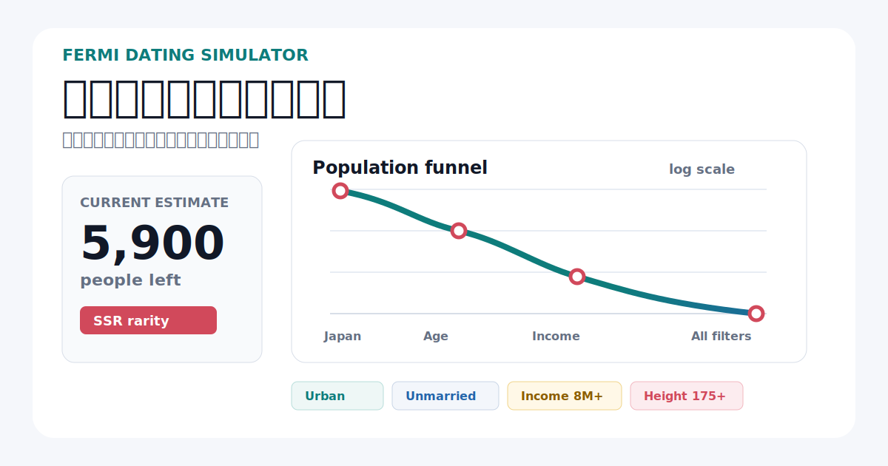

# Konkatsu Fermi Estimator

<p align="center">
  
</p>

「理想の相手がどれくらい存在するか」をフェルミ推定で可視化するツールです。

## デモ説明

検索対象の性別、年齢、居住地、未婚、年収、身長、学歴、外見、体型、職業、子供希望などの条件を ON/OFF できます。条件を追加するたびに、母集団に対して仮定した割合を掛け合わせ、残存人数がグラフ上で減っていきます。

初期状態は「極端な条件」のプリセットです。たとえば男性対象では、30代・都市部・未婚・年収800万以上・身長175cm以上・大卒以上・安定職という条件で、どれくらい母集団が残るかをすぐ確認できます。

## 例

「年収800万以上・身長175cm以上・大卒・安定職・30代・都市部・未婚」で絞ると、まず30代男性の人口に減り、そこから未婚率、都市居住、年収、身長、学歴、職業条件が順番に掛け合わされます。各条件は単体では現実的に見えても、複数を同時に満たす人数は急速に少なくなります。

## 注意書き

- このツールは推定です。
- 実際の人口、未婚率、所得分布、居住地分布とは異なる可能性があります。
- 条件同士の相関は単純化しており、原則として独立に近いものとして乗算しています。
- 数値の目的は統計的な正確さではなく、「条件を増やすと母集団が急減する」感覚を掴むことです。

## 機能

- React + TypeScript + Vite で実装
- 条件 ON/OFF とセレクト操作によるリアルタイム更新
- 男女別に異なる分布を利用
- 女性検索時の学歴、カップ数、経験人数条件
- 条件ごとの残存人数を Recharts で可視化
- 平均条件との比較
- 男女比較モード
- 初期状態で極端条件プリセットを適用
- `src/data` と `src/utils` を分離し、将来的な API 化を想定

## セットアップ

```bash
npm install
npm run dev
```

ビルド確認:

```bash
npm run build
```

## GitHub Pages で公開

このリポジトリは GitHub Pages の project site として公開できます。

1. GitHub に push します。
2. Repository の `Settings` -> `Pages` を開きます。
3. `Build and deployment` の `Source` を `GitHub Actions` にします。
4. `main` ブランチに push すると `.github/workflows/deploy.yml` が `dist/` を自動デプロイします。

公開 URL は通常、次の形式になります。

```text
https://<github-user-name>.github.io/konkatsu-fermi-estimator/
```

GitHub Pages 用ビルドでは Vite の `base` が `/konkatsu-fermi-estimator/` へ切り替わります。ローカルで同じビルドを確認する場合は次を使います。

```bash
npm run build:pages
```

## ディレクトリ構成

```text
src/
  components/
  hooks/
  utils/
  data/
docs/
  assumptions.md
  experiments.md
```

## 設計メモ

推定は `src/utils/estimator.ts` の `estimatePopulation` に集約しています。UI から切り離された純粋関数なので、将来的に同じロジックを API、CLI、バッチ検証に移しやすい構造です。
